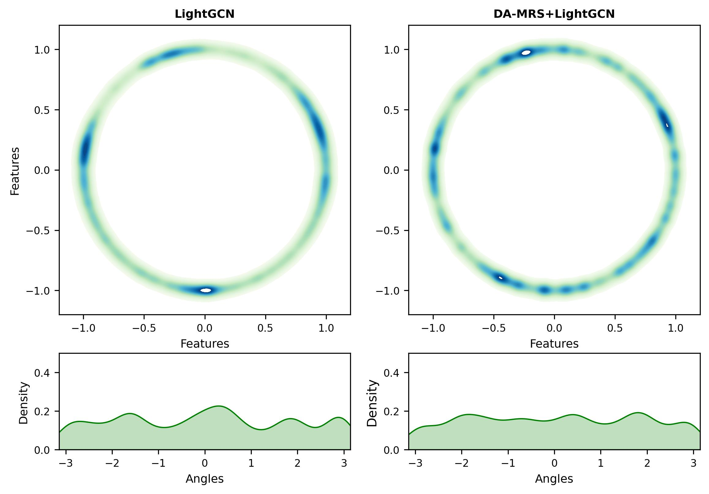
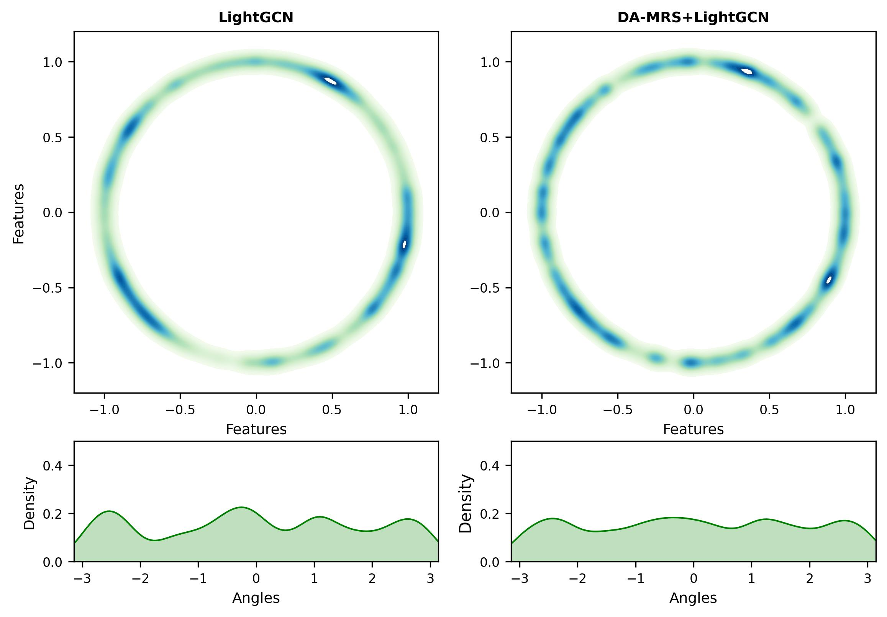
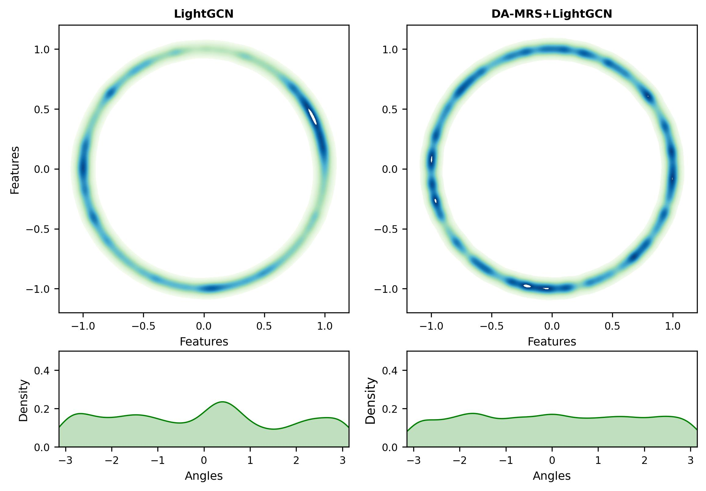

# MA-MRS

### Visualization experiments. 

We perform visualization experiments on the Baby, Sports, and Clothing datasets using LightGCN and DA-MRS+LightGCN.  **The visualization results are in the “./image” folder.**

1.  We first map the learned item representations to 2-dimensional normalized vectors on the unit hypersphere $S^1$ (i.e., circle with radius 1) by using t-SNE. All the representations are obtained when the methods reach their best performance. Then we plot the feature distributions with the nonparametric Gaussian kernel density estimation in $R^2$. For a clearer presentation, the density estimations on angles for each point on $S^1$ are also visualized. 
2.  As shown in Figure, LightGCN shows highly clustered features that mainly reside on some narrow arcs, while DA-MRS has more uniform distributions, and the density estimation curves are less sharp. A more uniform representation distribution can preserve the intrinsic characteristics of nodes and improve the generalization ability [1]. This suggests that through DA-MRS, the model can learn *more comprehensive item representations, enhance generalization ability, and achieve better recommendation performance*.

Figure 1: The visualization experiment on baby dataset. 

Figure 2: The visualization experiment on sports dataset. 

Figure 3: The visualization experiment on clothing dataset. 

[1] Junliang Yu, Hongzhi Yin, Xin Xia, Tong Chen, Lizhen Cui, and Quoc Viet Hung Nguyen. 2022. Are Graph Augmentations Necessary? Simple Graph Contrastive&nbsp;Learning for Recommendation. In Proceedings of the 45th International ACM SIGIR Conference on Research and Development in Information Retrieval (SIGIR '22). Association for Computing Machinery, 1294–1303.
